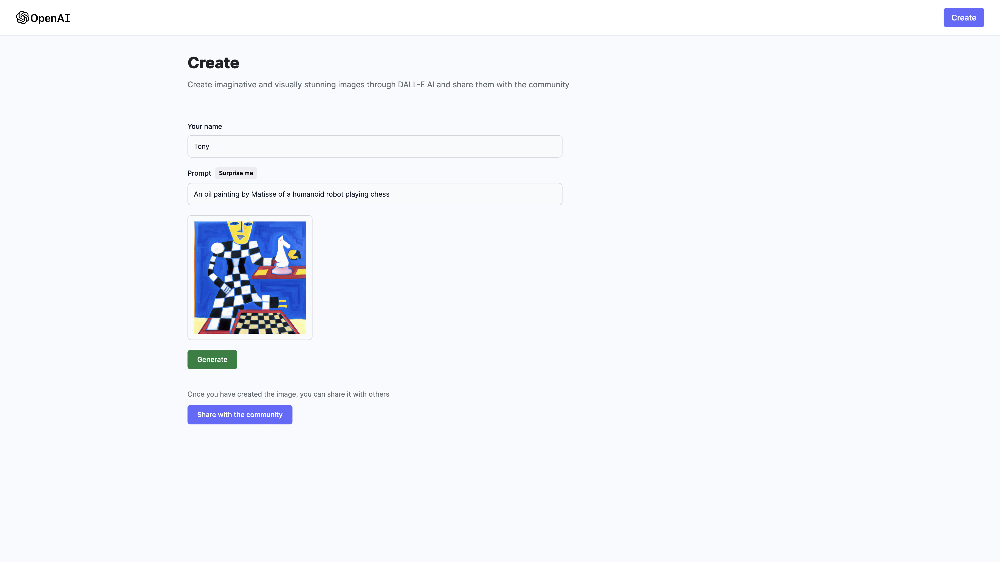

# DALL•E  2 Clone

### This application is a full stack project built using the **MERN** stack.

Take a look at the app [here](https://incomparable-toffee-e81398.netlify.app)

# Description
 A clone of OpenAI's **DALL•E 2** app, built using the MERN stack (MongoDB, ExpressJS, ReactJS, and NodeJS), Tailwind CSS, the OpenAI API, and Cloudinary.

<kbd>

</kbd>

<kbd>

</kbd>

# Tools Used

### Development Environment
* Node.js

### Libraries & Frameworks
* React 
* Mongoose
* Express 

### Database
* MongoDB

### Hosting
* Front End: Netlify
* Back End: Render

### Image Management
* Cloudinary

### Other
* Tailwind

### API
* OpenAI

# Features

### Users are able to:

* create imaginative and visually stunning images through DALL•E 2 AI.
* browse through a collection of images generated by DALL-E AI.
* share the generated imags with the community.
* download the generated and shared images.
* view details of the shared images. 

